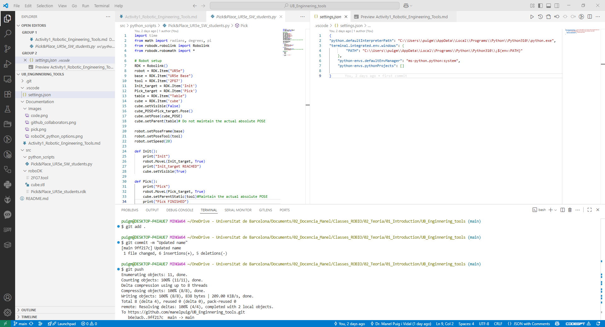
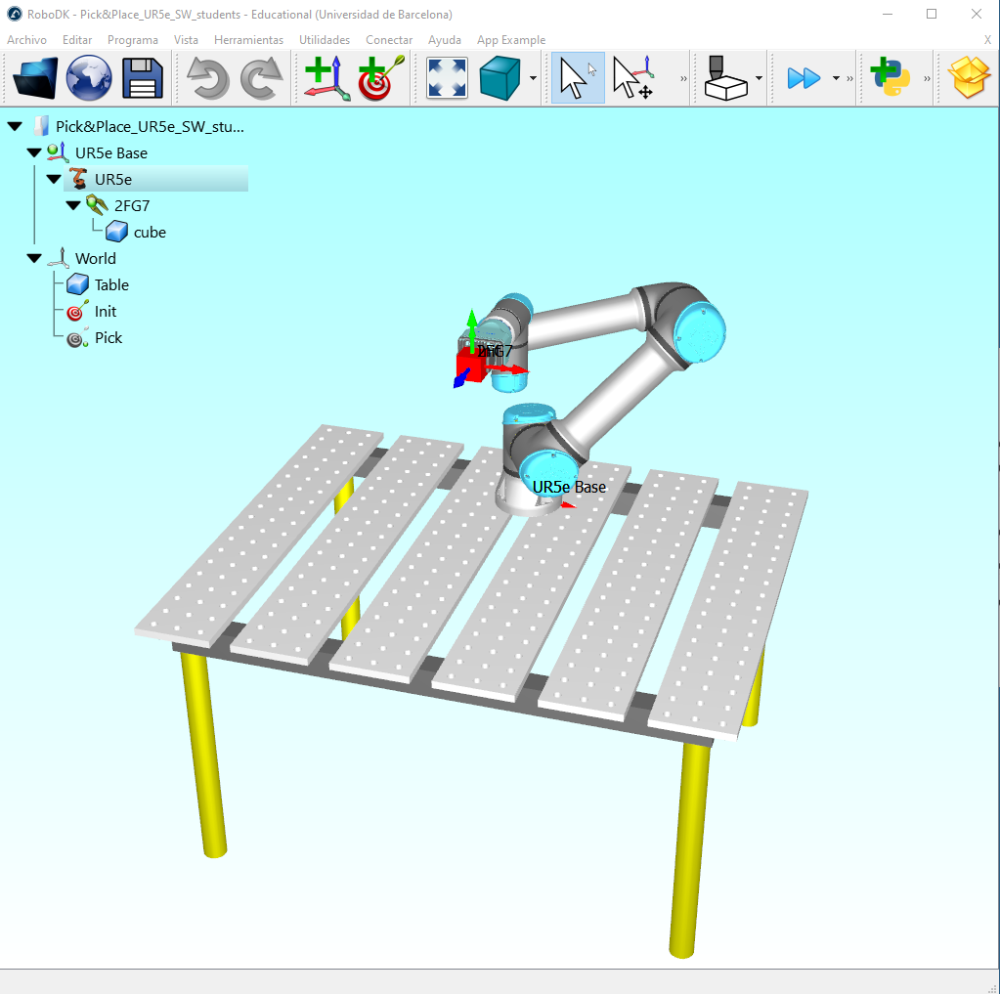

# Robotic Engineering tools

We will use the following tools for this course:
- [Visual Studio Code](https://code.visualstudio.com/) (VSCode) as the code editor
    - Select `Download` and choose your platform
    - Open VScode and install the following extensions:
        - Python (from Microsoft)
        - Pylance (from Microsoft)
        - Jupyter (from Microsoft)
        - Industrial Robots (by RoboDK)
- [Python](https://www.python.org/) as the programming language
    - For better stability, we will use version 3.10.11 (https://www.python.org/downloads/release/python-31011/)
    - In Files section choose your platform installer (windows or Mac)
    - Make sure to check the box `Add Python 3.10 to PATH` before clicking `Install Now`
    - Close VScode and open it again. In a terminal, to see the python path, type:
        - `where python` (Windows)
        - `which python` (Mac)
    - Add a file `.vscode/settings.json` with:
        ````json
        {
        "python.defaultInterpreterPath": "C:\\Users\\puigm\\AppData\\Local\\Programs\\Python\\Python310\\python.exe",
        "terminal.integrated.env.windows": {
                "PATH": "C:\\Users\\puigm\\AppData\\Local\\Programs\\Python\\Python310\\;${env:PATH}"
            }
        }
        ````
        > Change the path to your python installation you have obtained in the previous point

    - Select from the lower right menu the python interpreter (Python 3.10.11). Some modifications will be made in your `settings.json` file
- [RoboDK](https://robodk.com/) as the simulation and programming software
    - Download and install RoboDK for your platform (Windows or Mac)
        - Open "Tools"-->"Options"-->"Python" and set the path to your python installation and python editor to VScode path
        
    - Open a terminal in VScode and install:
        - `python -m pip install robodk`

- [GitHub](https://github.com/) for version control and collaboration
    - Create a GitHub account. You will need to specify:
        - name: "your_name"
        - email: "your_email@alumnes.ub.edu"
    - Create a [Personal Access Token (PAT)]:
        - Log in to your GitHub account
        - Click on your profile picture and select `settings`
        - Select `Developer Settings`
        - Select Access Personal Access Tokens: Choose Tokens (classic)
        - Click Generate new token (classic) and configure it:
            - Add a note to describe the purpose of the token (i.e. "ROS repo sync.")
            - Set the expiration (e.g., 30 days, 60 days, or no expiration).
            - Under Scopes, select the permissions required:
            - For repository sync, you usually need: repo (full control of private repositories)
            - Click Generate token
        - Once the token is generated, copy it immediately in a local file. You won't be able to see it again after leaving the page.

    - Install [Git](https://git-scm.com/downloads) for your platform (Windows or Mac)

# Laboratory Projects github synchronisation

The Laboratory Projects and some Activities will be made in cooperation with the students group. You will proceed:

- I will give you a project/Activity template in my github account: https://github.com/manelpuig/UB_Enginnering_tools.git
- One student plays the role of `Director`. This student makes a "Fork" of the Professor's github project.
- The `Director` accept the other students as `Collaborators`

  > The Github project will be the `UB_Engineering_tools` in this Activity

- Then the `Collaborators` will make a "fork" of the `Director`'s github project.
- The `Collaborators` will be able to update the github `Director`'s project and participate on the project generation
- Create in your Laptop a local desired Project/Activity folder. Open VScode in that folder.
- First time, clone your forked `Director`'s github project. In `Git bash` VScode terminal, type:
  ```shell
  git clone https://github.com/director_username/UB_Engineering_Tools
  ```
  >Successives times you can update the project with:
  ```shell
  cd UB_Engineering_Tools
  git pull
  ```
- First time, open a "Git bash" terminal and configure git with your credentials:
    ```git
    git config --global user.name "your_name"
    git config --global user.email "your_email@alumnes.ub.edu"
    ```
- To add your contributions to the project, you will proceed:
    ````shell
    git add .
    git commit -m "your_commit_message"
    git push
    ````
- You will have to enter your PAT
- The `Director` repository is updated with the collaborator's contributions

## Activity 1: roboDK Pick cube with UR5e robot arm

The objective of this activity is to work collaboratively on a RoboDK project:
- utilizing GitHub within the 2-3 members of the Lab-Group
- Verify the Tools installation is working correctly of each student
- The students will collaborate in github according to the indications
- All the students have made contributions to the project

For that purpose, you will make a project to pick a cube from the table with a 2FG7 gripper mounted on UR5e robot arm:
- From FileManager, open the robodk program `Pick&Place_UR5e_students.rdk`
- From VScode, open the `settings.json` file and the python file `Pick&Place_UR5e_SW_students.py` on the side
- Run the python code and see how the robot arm is moving.
- Take a picture of roboDK screen (pick.png) and copy it to `Images` folder
- `Sync` your changes to your github project as explained in previous section. 
- Take picture of VScode terminal when syncronizing your changes (sync.png) and copy it to `Images` folder.
- Verify that the 2 pictures appear below. Update your name below.
- `Sync` your changes to your github project as explained in previous section. 

**Activity Director:** Manel Puig i Vidal
<div style="width: 800px; margin: 0 auto; display: flex; justify-content: center; gap: 20px; flex-wrap: wrap;">
  <figure style="text-align: center; display: flex; flex-direction: column; align-items: center;">
    
    <figcaption style="font-style: italic; font-size: 0.9em; margin-top: 5px;">
      a) VScode
    </figcaption>
  </figure>

  <figure style="text-align: center; display: flex; flex-direction: column; align-items: center;">
    
    <figcaption style="font-style: italic; font-size: 0.9em; margin-top: 5px;">
      b) roboDK Pick cube
    </figcaption>
  </figure>
</div>


**Activity Student1:** Name?
<div style="width: 800px; margin: 0 auto; display: flex; justify-content: center; gap: 20px; flex-wrap: wrap;">
  <figure style="text-align: center;">
    
    <figcaption style="font-style: italic; font-size: 0.9em;">
      a) VScode
    </figcaption>
  </figure>

  <figure style="text-align: center;">
    
    <figcaption style="font-style: italic; font-size: 0.9em;">
      b) roboDK Pick cube
    </figcaption>
  </figure>
</div>


**Activity Student 2:** Name?
<div style="width: 800px; margin: 0 auto; display: flex; justify-content: center; gap: 20px; flex-wrap: wrap;">
  <figure style="text-align: center;">
    
    <figcaption style="font-style: italic; font-size: 0.9em; margin-top: 25px;">
      a) VScode
    </figcaption>
  </figure>

  <figure style="text-align: center;">
    
    <figcaption style="font-style: italic; font-size: 0.9em; margin-top: 25px;">
      b) roboDK Pick cube
    </figcaption>
  </figure>
</div>

## Delivery Activity 1

Once each student from the Laboratory subgroup has updated this github project from the Director github project, each student can upload the Activity 1 Delivery with:
- Your github project link (something like: `https://github.com/your_username/UB_Engineering_Tools`)
